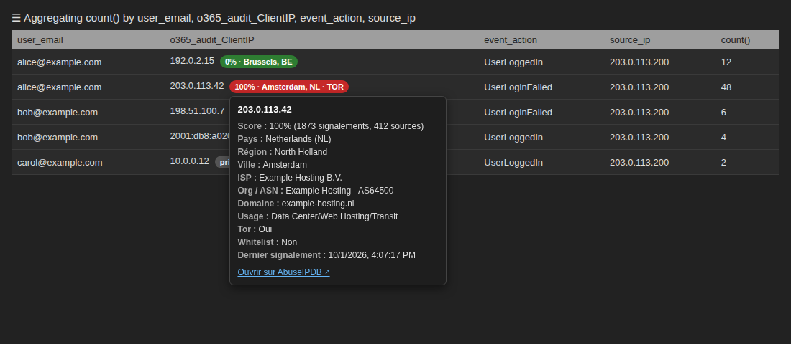
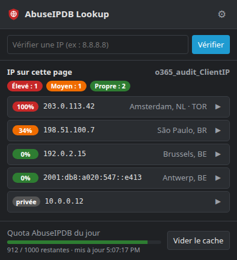
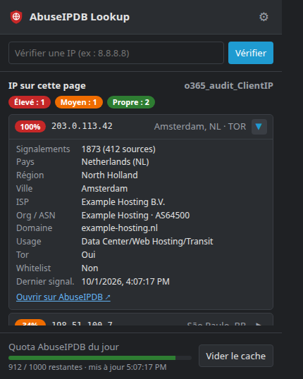
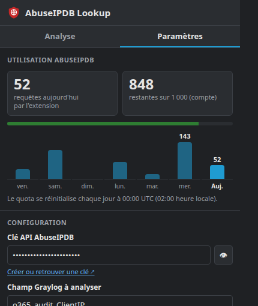

<div align="center">


# Graylog AbuseIPDB Lookup

**Réputation AbuseIPDB et géolocalisation des adresses IP, directement dans Graylog.**

[](https://github.com/eldriic/graylog-abuseipdb/actions/workflows/ci.yml)


</div>

---

Extension de navigateur pour analystes SOC : elle repère un champ Graylog précis
(par défaut `o365_audit_ClientIP`) et affiche à côté de chaque IP son score
d'abus, sa ville et son pays — **sans toucher aux autres IP de la page**.

<p align="center">
  
</p>

## Sommaire

- [Fonctionnalités](#fonctionnalités)
- [Navigateurs supportés](#navigateurs-supportés)
- [Installation](#installation)
- [Configuration](#configuration)
- [Utilisation](#utilisation)
- [Développement](#développement)
- [Confidentialité](#confidentialité)
- [Licence](#licence)

## Fonctionnalités

- **Badge par IP** dans les widgets d'agrégation, les tableaux de messages et
  la vue détaillée d'un message : score, ville, pays, mention `TOR`.
- **Info-bulle détaillée** au survol : signalements, ISP, ASN, domaine, type
  d'usage, whitelist, date du dernier signalement, lien vers AbuseIPDB.
- **Popup** dans la barre d'outils, en deux onglets :
  - **Analyse** : IP de la page triées par risque avec détails dépliables,
    recherche manuelle d'une IP ;
  - **Paramètres** : clé API (avec test de validité), champ Graylog, cache, et
    suivi de l'utilisation AbuseIPDB — requêtes du jour, quota restant du
    compte, historique sur 7 jours.
- **Champ configurable** : n'importe quel champ Graylog contenant une IP.
- **Économe en quota** : cache local (24 h par défaut) et déduplication des
  requêtes ; les IP privées (RFC 1918, loopback, link-local, ULA) ne sont
  jamais envoyées.

<p align="center">
  
  &nbsp;
  
  &nbsp;
  
</p>

| Couleur   | Score     | Signification                    |
| --------- | --------- | -------------------------------- |
| 🟢 Vert   | 0 %       | Aucun signalement                |
| 🟡 Jaune  | 1 – 24 %  | Signalements isolés              |
| 🟠 Orange | 25 – 74 % | Suspect                          |
| 🔴 Rouge  | 75 %+     | Malveillant avec forte confiance |
| ⚪ Gris   | —         | IP privée, non interrogée        |

## Navigateurs supportés

| Navigateur                          | Build          | Manifest |
| ----------------------------------- | -------------- | -------- |
| Firefox 142+                        | `dist/firefox` | V2       |
| Chrome, Edge, Brave, Opera, Vivaldi | `dist/chrome`  | V3       |

> Safari n'est pas supporté : la conversion exige macOS et Xcode
> (`xcrun safari-web-extension-converter`).

## Installation

Récupérez l'archive du navigateur voulu dans les
[Releases](https://github.com/eldriic/graylog-abuseipdb/releases), ou
construisez-la vous-même (voir [Développement](#développement)).

> 📘 **Guide pas à pas** (Chrome, Firefox, configuration, mise à jour,
> dépannage) : [docs/INSTALL.md](docs/INSTALL.md).

### Chrome, Edge, Brave, Opera, Vivaldi

1. Décompressez `graylog-abuseipdb-chrome-<version>.zip` (ou utilisez `dist/chrome`).
2. Ouvrez `chrome://extensions` (`edge://extensions` sur Edge, `brave://extensions` sur Brave).
3. Activez le **Mode développeur**.
4. Cliquez sur **Charger l'extension non empaquetée** et sélectionnez le dossier.

### Firefox

Firefox n'installe de façon permanente que des extensions signées par Mozilla
(signature gratuite, sans publication sur le store) :

```bash
export WEB_EXT_API_KEY='user:xxxxxxxx:xxx'   # https://addons.mozilla.org/developers/addon/api/key/
export WEB_EXT_API_SECRET='…'
npm run sign:firefox
```

Le fichier `.xpi` signé est déposé dans `artifacts/` : glissez-le dans une
fenêtre Firefox.

Pour un test rapide sans signature : `about:debugging#/runtime/this-firefox` →
**Charger un module complémentaire temporaire** → `dist/firefox/manifest.json`
(retiré au redémarrage de Firefox).

## Configuration

Cliquez sur l'icône de l'extension → onglet **Paramètres** (le même panneau est
disponible dans les options du navigateur) :

| Paramètre            | Défaut                | Description                                                            |
| -------------------- | --------------------- | ---------------------------------------------------------------------- |
| Clé API AbuseIPDB    | —                     | [abuseipdb.com/account/api](https://www.abuseipdb.com/account/api)     |
| Nom du champ Graylog | `o365_audit_ClientIP` | Colonne / champ à enrichir (insensible à la casse)                     |
| `maxAgeInDays`       | `90`                  | Fenêtre d'historique des signalements AbuseIPDB                        |
| Durée du cache       | `24` h                | `0` pour désactiver                                                    |

**Tester la clé** effectue une vraie requête (elle compte dans le quota) et
affiche le quota restant.

Le plan gratuit AbuseIPDB autorise **1 000 requêtes par jour**, réinitialisées
à 00:00 UTC. L'onglet Paramètres distingue :

- **les requêtes faites par l'extension** dans ce navigateur, comptées jour par
  jour (seules les requêtes acceptées par AbuseIPDB sont comptées ; les
  résultats servis depuis le cache ne consomment rien) ;
- **le quota restant du compte**, lu dans les en-têtes de réponse d'AbuseIPDB —
  il inclut donc l'usage de la même clé par d'autres outils.

## Utilisation

1. Ouvrez une recherche Graylog dont le résultat contient le champ configuré.
2. Les badges apparaissent automatiquement, y compris après un rafraîchissement
   ou un changement de requête.
3. Survolez un badge pour le détail, ou cliquez sur l'icône de l'extension pour
   la vue d'ensemble ; le bouton ↻ actualise la liste après un changement de
   recherche.

## Développement

Prérequis : Node.js 20+.

```bash
npm install
npm run build            # dist/firefox et dist/chrome
npm run lint             # vérification syntaxe + web-ext lint (Firefox)
npm run package          # archives .zip dans artifacts/
npm run start:firefox    # lance Firefox avec l'extension chargée
npm run start:chrome     # lance Chromium avec l'extension chargée
```

### Structure

```
├── manifests/
│   ├── base.json          # champs communs
│   ├── firefox.json       # Manifest V2 (background scripts, gecko id)
│   └── chrome.json        # Manifest V3 (service worker, host_permissions)
├── scripts/
│   ├── build.mjs          # src/ + manifest fusionné → dist/<navigateur>/
│   └── check.mjs          # vérification de syntaxe JavaScript
└── src/
    ├── background/        # requêtes AbuseIPDB / ipwho.is, cache, quota
    ├── content/           # détection du champ Graylog et badges
    ├── popup/             # interface de la barre d'outils
    ├── options/           # page de paramètres
    ├── shared/            # compatibilité browser/chrome, IP, paramètres, panneau partagé
    └── icons/
```

Le code source est unique : `src/shared/api.js` expose `ext`, qui pointe vers
`browser` (Firefox) ou `chrome` (Chromium). La version est définie une seule
fois, dans `package.json`, et injectée dans chaque manifest au build.

### Publier une version

1. Mettez à jour `version` dans `package.json` et le [CHANGELOG](CHANGELOG.md).
2. Committez, puis créez et poussez un tag :
   ```bash
   git tag v1.2.0 && git push origin v1.2.0
   ```
3. La CI publie une Release GitHub avec les archives Firefox et Chrome.

## Confidentialité

- Seules les IP **publiques** du champ configuré sont envoyées, et uniquement à
  [AbuseIPDB](https://www.abuseipdb.com) (réputation) et
  [ipwho.is](https://ipwho.is) (ville / région).
- La clé API et le cache restent dans le stockage local du navigateur ; aucune
  autre donnée de la page ne quitte la machine.
- Détails : [politique de confidentialité](PRIVACY.md).
- Les captures d'écran de ce dépôt utilisent des adresses de documentation
  (RFC 5737 / RFC 3849) et des données fictives.

## Licence

[MIT](LICENSE)
